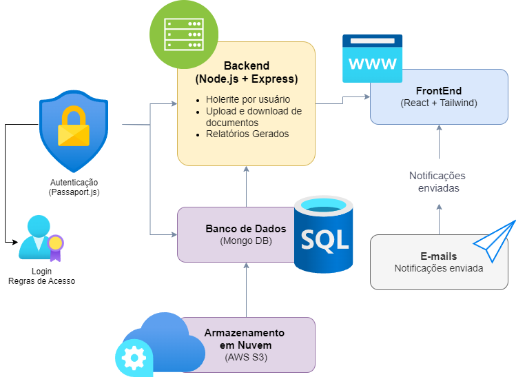
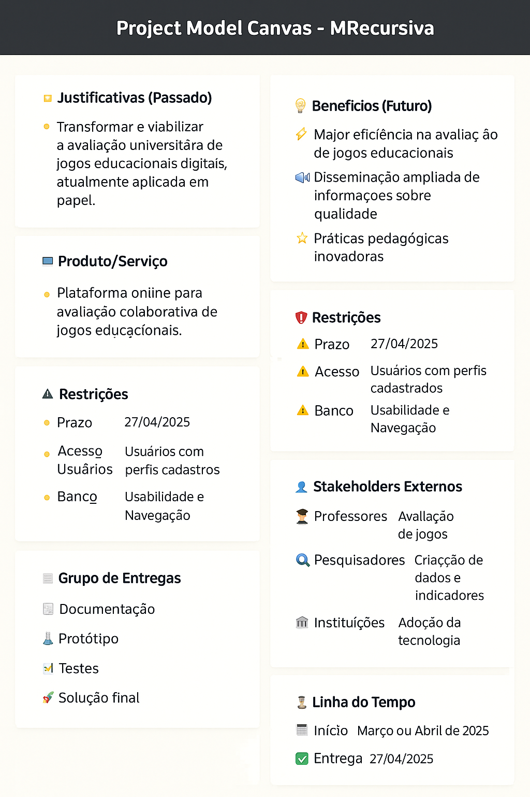
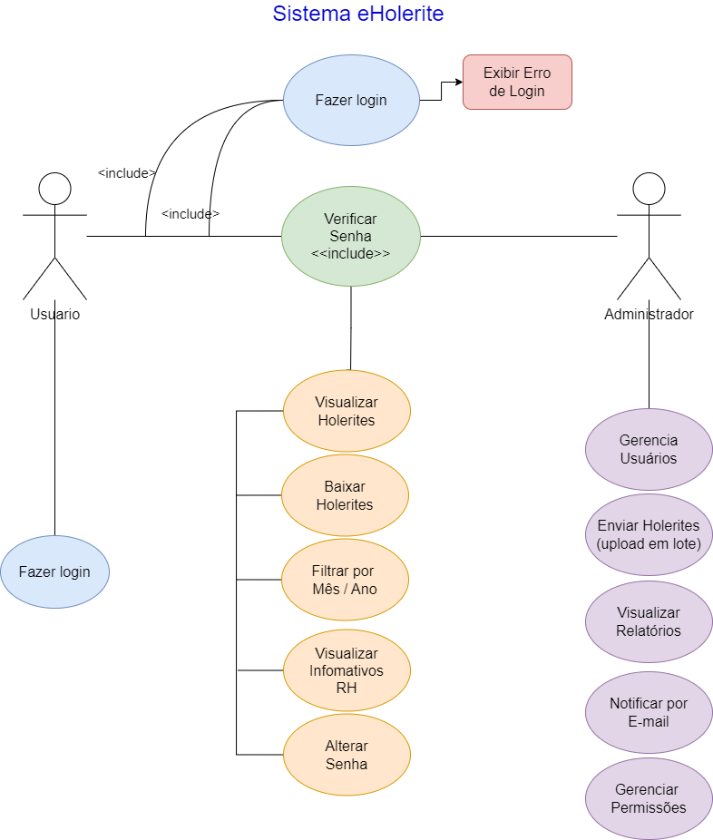
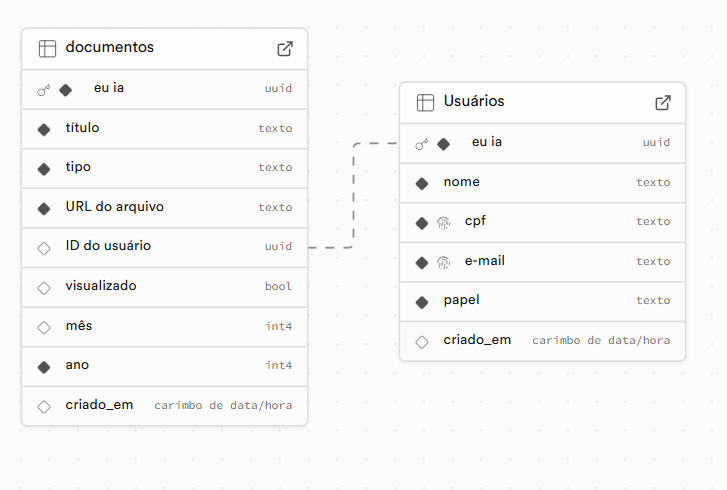
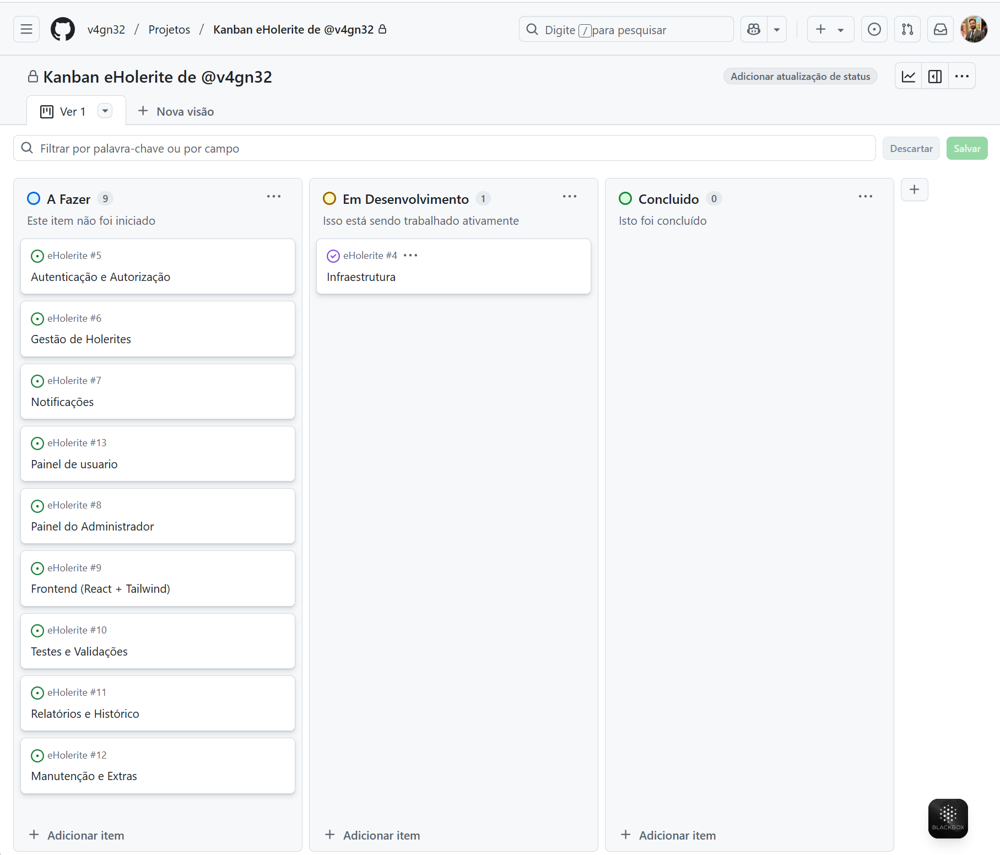

# 📄 Especificação do Projeto — Portal de Documentos

## ✅ Definição do Problema

Empresas enfrentam dificuldades em gerenciar, distribuir e organizar holerites e documentos corporativos de forma eficiente e segura. O uso de métodos tradicionais (como envio por e-mail ou impressão física) é pouco escalável, propenso a erros e fere boas práticas de proteção de dados.

## 💡 Proposta de Solução

Desenvolver uma plataforma online chamada **Portal de Documentos**, que permita o envio, armazenamento, organização e consulta de holerites e documentos de RH. O sistema visa reduzir o tempo de entrega de documentos, garantir segurança no acesso e permitir integração com serviços de nuvem e notificações automatizadas.

---

## 👥 Usuários

| Tipo de Usuário   | Descrição                                                   | Responsabilidades                                                                         |
| ----------------- | ----------------------------------------------------------- | ----------------------------------------------------------------------------------------- |
| **Administrador** | RH ou responsável pelo envio e gestão de documentos.        | Fazer upload de holerites, cadastrar usuários, visualizar relatórios, configurar alertas. |
| **Colaborador**   | Funcionário da empresa que acessa seus documentos pessoais. | Consultar holerites, baixar arquivos, visualizar comunicados e notificações.              |

---

## 🛠️ Arquitetura e Tecnologias

- **Frontend:** React.js + TailwindCSS
- **Backend:** Node.js + Express
- **Banco de Dados:** PostgreSQL
- **Armazenamento:** AWS S3 (arquivos PDF)
- **Autenticação:** JWT com roles (admin e usuário)
- **Hospedagem:** Render
- **Notificações:** E-mail automático e (futuramente) WhatsApp API



> [!IMPORTANT]
>
> Um diagrama de componentes será criado para representar a interação entre os módulos da plataforma.

---

# 💰 Estrutura de Custos — Projeto Portal de Documentos

## 📦 Custo do Projeto (Entrega única)

| Item                          | Descrição                                        | Valor Estimado    |
| ----------------------------- | ------------------------------------------------ | ----------------- |
| **Desenvolvimento**           | Desenvolvimento completo do sistema              | R$ 8.500,00       |
| **Hospedagem (6 meses)**      | Custo baseado em serviço da Railway              | R$ 150,00         |
| **Registro de Domínio**       | Registro .com.br anual                           | R$ 40,00          |
| **Infraestrutura e Suporte**  | Configuração de nuvem, backup e automações       | R$ 810,00         |
| **Email Profissional**        | Google Workspace por 6 meses (opcional incluído) | R$ 180,00         |
| **🔸 Subtotal**               |                                                  | R$ 7.680,00       |
| **💸 Desconto Aplicado**      | Desconto comercial para fechamento               | **- R$ 1.000,00** |
| **💰 Valor Final do Projeto** | **Total com desconto incluso**                   | **R$ 7.500,00**   |

---

## 🔄 Mensalidade Pós-Entrega (manutenção + suporte)

| Descrição                                  | Valor Original | Desconto Aplicado | Valor com Desconto |
| ------------------------------------------ | -------------- | ----------------- | ------------------ |
| Manutenção, atualizações e suporte técnico | R$ 490,00      | R$ 100,00         | **R$ 390,00/mês**  |

---

**📌 Observação:**  
Os valores cobrem todo o desenvolvimento, setup de infraestrutura, deploy, domínio, armazenamento e configurações iniciais.  
A mensalidade cobre atualizações, monitoramento, suporte técnico e pequenas melhorias contínuas no sistema.



---

## 🧩 Funcionalidades Principais

### Requisitos Funcionais

| ID     | Descrição                                                               |
| ------ | ----------------------------------------------------------------------- |
| RF-001 | Cadastro e login de usuários com autenticação JWT.                      |
| RF-002 | Cadastro de usuários pelo administrador (com função `admin`).           |
| RF-003 | Upload em lote de holerites em PDF com separação automática por CPF.    |
| RF-004 | Armazenamento dos arquivos em pastas por ano/mês para cada colaborador. |
| RF-005 | Consulta por mês e ano de holerites recebidos.                          |
| RF-006 | Notificações por e-mail ao disponibilizar novo documento.               |
| RF-007 | Visualização e download dos arquivos em PDF pelo colaborador.           |
| RF-008 | Tela de informativos de RH, visíveis por todos os colaboradores.        |
| RF-009 | Tela de relatórios com contagem de holerites enviados e recebidos.      |
| RF-010 | Logout e controle de sessão.                                            |

### Requisitos Não Funcionais

| ID      | Descrição                                                    |
| ------- | ------------------------------------------------------------ |
| RNF-001 | Sistema responsivo para dispositivos móveis.                 |
| RNF-002 | Tempo de resposta inferior a 3 segundos por requisição.      |
| RNF-003 | Dados sensíveis criptografados no banco (senhas, tokens).    |
| RNF-004 | Conformidade com a LGPD no armazenamento e acesso aos dados. |
| RNF-005 | Compatível com navegadores modernos: Chrome, Firefox e Edge. |

### Restrições do Projeto

| ID      | Descrição                                                                                        |
| ------- | ------------------------------------------------------------------------------------------------ |
| RST-001 | O projeto deverá ser desenvolvido e entregue no prazo máximo de 90 dias.                         |
| RST-002 | O sistema deverá utilizar obrigatoriamente as tecnologias: React, Node.js, PostgreSQL e AWS S3.  |
| RST-003 | O domínio e a infraestrutura devem ser previamente definidos pelo cliente.                       |
| RST-004 | A solução deverá operar apenas em ambiente web (não há versão mobile nativa prevista).           |
| RST-005 | O upload de arquivos é restrito ao formato PDF com nome padronizado por CPF.                     |
| RST-006 | O plano gratuito do serviço de hospedagem (Railway ou Render) será usado durante a fase inicial. |
| RST-007 | Qualquer alteração no escopo após o aceite da proposta implicará novo orçamento.                 |
| RST-008 | A conta de e-mail profissional (Google Workspace) é opcional e de responsabilidade do cliente.   |

## 🎯 Casos de Uso — Sistema Portal de Documentos

| ID     | Nome do Caso de Uso               | Ator                    | Descrição                                                             | Pré-condições               | Pós-condições                           |
| ------ | --------------------------------- | ----------------------- | --------------------------------------------------------------------- | --------------------------- | --------------------------------------- |
| UC-001 | Autenticar no Sistema             | Usuário / Administrador | Realiza login com e-mail e senha.                                     | -                           | Usuário autenticado ou erro exibido.    |
| UC-002 | Verificar Senha                   | Sistema                 | Valida a senha fornecida no login.                                    | Email e senha informados    | Autenticação aceita ou negada.          |
| UC-003 | Exibir Erro de Login              | Sistema                 | Exibe mensagem de erro em caso de falha na autenticação.              | Tentativa de login inválida | Usuário visualiza erro de autenticação. |
| UC-004 | Visualizar Holerites              | Usuário                 | Exibe a lista de holerites disponíveis para o colaborador.            | Usuário autenticado         | Lista de holerites apresentada.         |
| UC-005 | Baixar Holerites                  | Usuário                 | Permite o download dos holerites em PDF.                              | Holerites disponíveis       | Documento PDF baixado pelo usuário.     |
| UC-006 | Filtrar por Mês / Ano             | Usuário                 | Permite a filtragem dos holerites por período.                        | Holerites cadastrados       | Lista filtrada por data exibida.        |
| UC-007 | Visualizar Informativos RH        | Usuário                 | Mostra informativos publicados pelo RH.                               | Informativos cadastrados    | Conteúdo exibido ao usuário.            |
| UC-008 | Alterar Senha                     | Usuário                 | Permite que o usuário altere sua senha.                               | Usuário autenticado         | Nova senha salva e criptografada.       |
| UC-009 | Gerenciar Usuários                | Administrador           | Permite criar, editar ou excluir usuários.                            | Administrador autenticado   | Alterações refletidas na base de dados. |
| UC-010 | Enviar Holerites (Upload em lote) | Administrador           | Faz o upload de múltiplos PDFs e os associa aos respectivos usuários. | Administrador autenticado   | Holerites processados e vinculados.     |
| UC-011 | Visualizar Relatórios             | Administrador           | Exibe relatórios de holerites enviados/baixados.                      | Dados disponíveis           | Relatório visualizado.                  |
| UC-012 | Notificar por E-mail              | Administrador / Sistema | Envia e-mails notificando novos documentos disponíveis.               | Holerites enviados          | Usuário recebe notificação.             |
| UC-013 | Gerenciar Permissões              | Administrador           | Define níveis de acesso dos usuários (colaborador ou admin).          | Usuário existente           | Permissões atribuídas com sucesso.      |

## 

## 🔒 Segurança

- Autenticação por e-mail e senha forte
- Tokens expirados após período de inatividade
- Acesso restrito por roles
- Armazenamento seguro dos documentos com política de acesso por usuário autenticado

---

## 💼 Modelo de Negócio

- Licença de uso via assinatura mensal (SaaS)
- Implantação e treinamento inclusos no valor inicial
- Planos escaláveis por número de usuários ou volume de documentos

---

## 🧱 Estrutura de Banco de Dados (PostgreSQL)

- **users:** nome, email, senha criptografada, role, data de criação
- **documents:** userId, nome do arquivo, URL AWS S3, mês, ano, data de upload
- **notifications:** tipo, destinatário, dataEnvio, status
- **informativos:** título, conteúdo, data de publicação, visibilidade

---

## 📆 Cronograma por Etapas (Sprints)

| Etapa                                | Duração Estimada | Descrição                                       |
| ------------------------------------ | ---------------- | ----------------------------------------------- |
| Sprint 1 - Planejamento              | 3 dias           | Levantamento de requisitos e estrutura inicial. |
| Sprint 2 - Backend Inicial           | 5 dias           | Autenticação, cadastro de usuários, API base.   |
| Sprint 3 - Frontend Inicial          | 4 dias           | Layout inicial, telas de login e dashboard.     |
| Sprint 4 - Upload de Holerites       | 6 dias           | Upload em lote, AWS S3, separação por CPF.      |
| Sprint 5 - Visualização e Filtros    | 4 dias           | Tela de listagem por mês/ano e download.        |
| Sprint 6 - Notificações e Relatórios | 4 dias           | E-mails automáticos, tela de relatórios.        |
| Sprint 7 - Informativos e Ajustes    | 3 dias           | Tela de comunicados, testes finais e deploy.    |

**Total estimado: 29 dias úteis**

---

## 🧩 Projeto da Base de Dados — eHolerite

> [!important]
>
> As tabelas serão relacionadas através de chaves primárias e estrangeiras, garantindo a integridade dos dados.



```sql
-- -----------------------------------------------------
-- Schema eholerite
-- -----------------------------------------------------
CREATE SCHEMA IF NOT EXISTS `eholerite` DEFAULT CHARACTER SET utf8mb4;
USE `eholerite`;

-- -----------------------------------------------------
-- Table `roles`
-- -----------------------------------------------------
CREATE TABLE IF NOT EXISTS `roles` (
  `id` INT AUTO_INCREMENT,
  `name` VARCHAR(50) NOT NULL,
  PRIMARY KEY (`id`),
  UNIQUE KEY `name_UNIQUE` (`name`)
) ENGINE=InnoDB;

-- -----------------------------------------------------
-- Table `users`
-- -----------------------------------------------------
CREATE TABLE IF NOT EXISTS `users` (
  `id` INT AUTO_INCREMENT,
  `name` VARCHAR(100) NOT NULL,
  `email` VARCHAR(100) NOT NULL,
  `password` VARCHAR(255) NOT NULL,
  `created_at` DATETIME DEFAULT CURRENT_TIMESTAMP,
  `roles_id` INT NOT NULL,
  PRIMARY KEY (`id`),
  UNIQUE KEY `email_UNIQUE` (`email`),
  CONSTRAINT `fk_users_roles`
    FOREIGN KEY (`roles_id`)
    REFERENCES `roles` (`id`)
) ENGINE=InnoDB;

-- -----------------------------------------------------
-- Table `holerites`
-- -----------------------------------------------------
CREATE TABLE IF NOT EXISTS `holerites` (
  `id` INT AUTO_INCREMENT,
  `user_id` INT NOT NULL,
  `file_name` VARCHAR(255) NOT NULL,
  `file_url` TEXT NOT NULL,
  `period_year` INT NOT NULL,
  `period_month` INT NOT NULL,
  `uploaded_at` DATETIME DEFAULT CURRENT_TIMESTAMP,
  PRIMARY KEY (`id`),
  INDEX (`user_id`),
  CONSTRAINT `fk_holerites_users`
    FOREIGN KEY (`user_id`)
    REFERENCES `users` (`id`)
) ENGINE=InnoDB;

-- -----------------------------------------------------
-- Table `informativos`
-- -----------------------------------------------------
CREATE TABLE IF NOT EXISTS `informativos` (
  `id` INT AUTO_INCREMENT,
  `title` VARCHAR(150) NOT NULL,
  `content` TEXT NOT NULL,
  `published_at` DATETIME DEFAULT CURRENT_TIMESTAMP,
  PRIMARY KEY (`id`)
) ENGINE=InnoDB;

-- -----------------------------------------------------
-- Table `relatorios`
-- -----------------------------------------------------
CREATE TABLE IF NOT EXISTS `relatorios` (
  `id` INT AUTO_INCREMENT,
  `created_by` INT NOT NULL,
  `total_uploaded` INT NOT NULL,
  `total_downloaded` INT NOT NULL,
  `generated_at` DATETIME DEFAULT CURRENT_TIMESTAMP,
  PRIMARY KEY (`id`),
  CONSTRAINT `fk_relatorios_users`
    FOREIGN KEY (`created_by`)
    REFERENCES `users` (`id`)
) ENGINE=InnoDB;

-- -----------------------------------------------------
-- Table `audit_logs`
-- -----------------------------------------------------
CREATE TABLE IF NOT EXISTS `audit_logs` (
  `id` INT AUTO_INCREMENT,
  `user_id` INT,
  `action` VARCHAR(100),
  `description` TEXT,
  `timestamp` DATETIME DEFAULT CURRENT_TIMESTAMP,
  PRIMARY KEY (`id`),
  FOREIGN KEY (`user_id`) REFERENCES `users`(`id`)
) ENGINE=InnoDB;

-- -----------------------------------------------------
-- Table `password_tokens`
-- -----------------------------------------------------
CREATE TABLE IF NOT EXISTS `password_tokens` (
  `id` INT AUTO_INCREMENT,
  `user_id` INT NOT NULL,
  `token` TEXT NOT NULL,
  `created_at` DATETIME DEFAULT CURRENT_TIMESTAMP,
  `expires_at` DATETIME,
  PRIMARY KEY (`id`),
  CONSTRAINT `fk_password_tokens_users`
    FOREIGN KEY (`user_id`)
    REFERENCES `users` (`id`)
) ENGINE=InnoDB;

-- -----------------------------------------------------
-- Configurações Finais
-- -----------------------------------------------------
SET SQL_MODE=@OLD_SQL_MODE;
SET FOREIGN_KEY_CHECKS=@OLD_FOREIGN_KEY_CHECKS;
SET UNIQUE_CHECKS=@OLD_UNIQUE_CHECKS;
```

---

# Kanban


