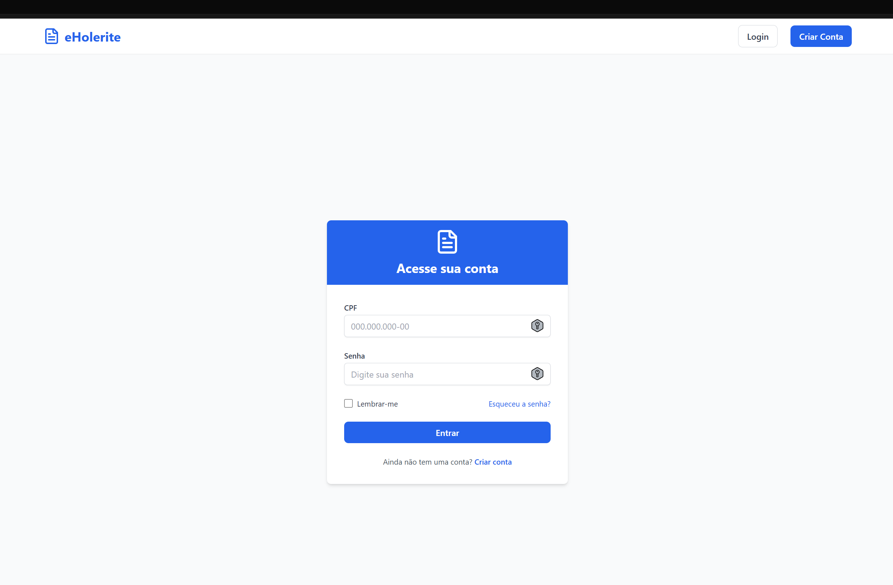
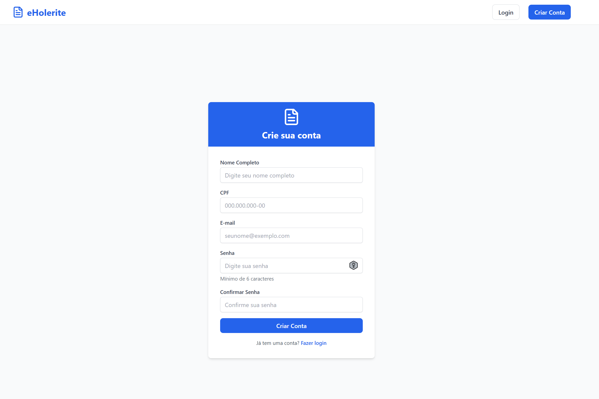
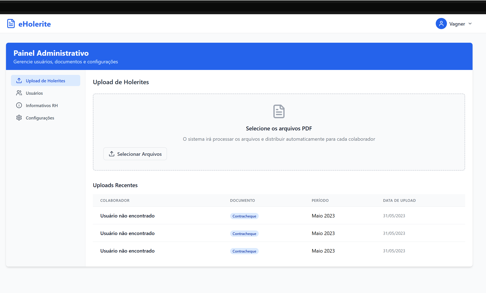
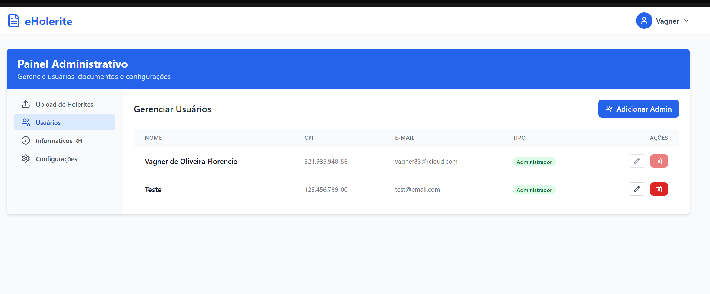
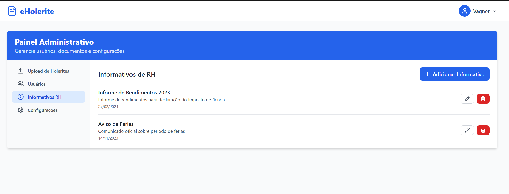
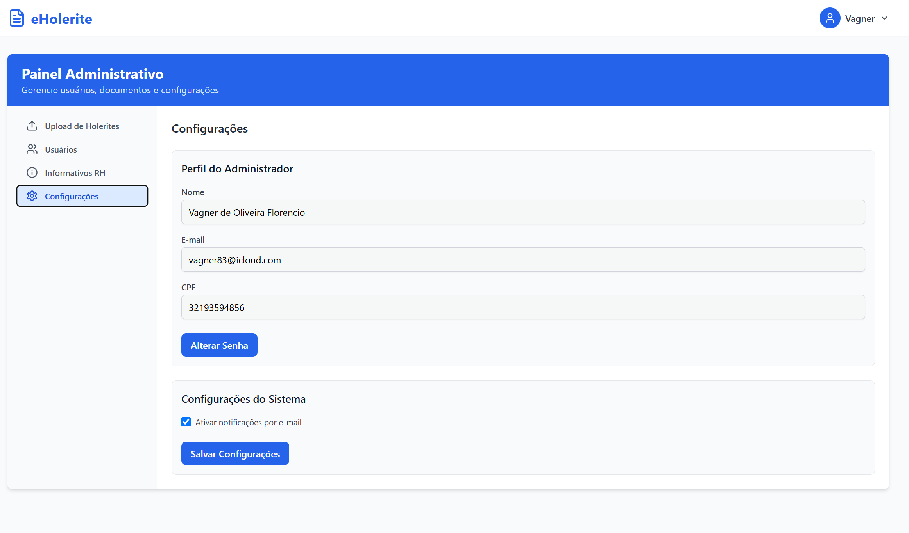
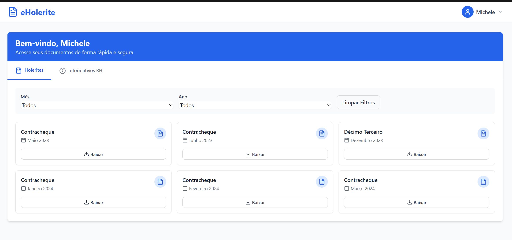
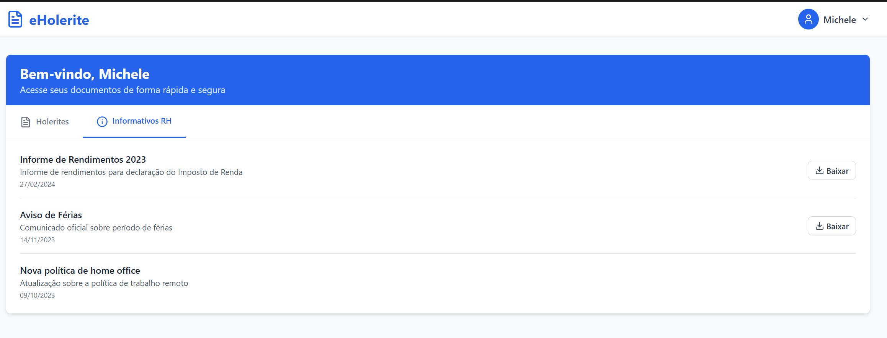
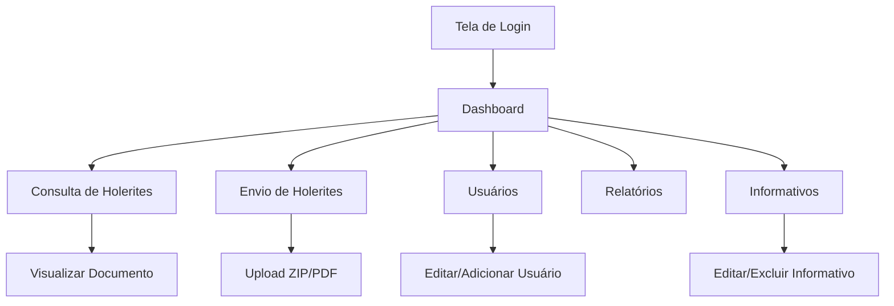

# Projeto de Interface - Portal de Documentos

## 📘 Visão Geral

Documentação das telas e fluxos de interface do sistema **Portal de Documentos**, uma plataforma para disponibilização digital de holerites, documentos corporativos e informativos.

---

## 🖥️ Telas do Sistema

### 1. Tela Home

**Descrição:**

- Informações do sistema

### 2. Tela de Login

**Descrição:**

- Campos para e-mail e senha
- Botão "Entrar"
- Link para "Esqueci minha senha"
- Link para "Cadastrar-se"

---

### 3. Tela de Cadastro

**Descrição:**

- Campos para nome completo, e-mail, senha e confirmação de senha
- Botão "Criar conta"
- Link para login

---

### 4. Dashboard (Painel Principal)

**Elementos:**

- Menu lateral com navegação (Entregas, Holerites, Relatórios, Usuários)
- Painéis com resumo (últimos documentos, número de usuários, entregas em atraso)
- Gráficos ou alertas de vencimentos

---

### 5. Tela de Envio de Holerites

**Funcionalidades:**

- Upload em massa (.zip ou múltiplos .pdf)
- Detecção automática de nome e CPF nos PDFs
- Associação automática com o usuário
- Filtros por mês/ano
- Botão para reprocessar documentos

---

### 6. Tela de Consulta de Holerites

**Elementos:**

- Tabela com colunas: Nome, Mês, Ano, Documento, Situação
- Download do PDF
- Filtro por usuário, mês e ano
- Visualização do documento em modal ou nova aba

---

### 7. Tela de Gerenciamento de Usuários

**Funcionalidades:**

- Listagem de usuários com CPF, e-mail e tipo (admin ou colaborador)
- Ações de ativar, desativar e editar
- Criação manual de usuários
- Importação via planilha (.csv)

---

### 8. Tela de Relatórios

**Funcionalidades:**

- Relatórios de envio por período
- Relatórios de usuários que não visualizaram
- Exportação em PDF e Excel

---

### 9. Tela de Informativos

**Elementos:**

- Lista de comunicados do RH
- Botão "Criar novo"
- Editor de texto (WYSIWYG)
- Data de publicação e destinatários

---

## 🔁 Fluxo de Navegação

